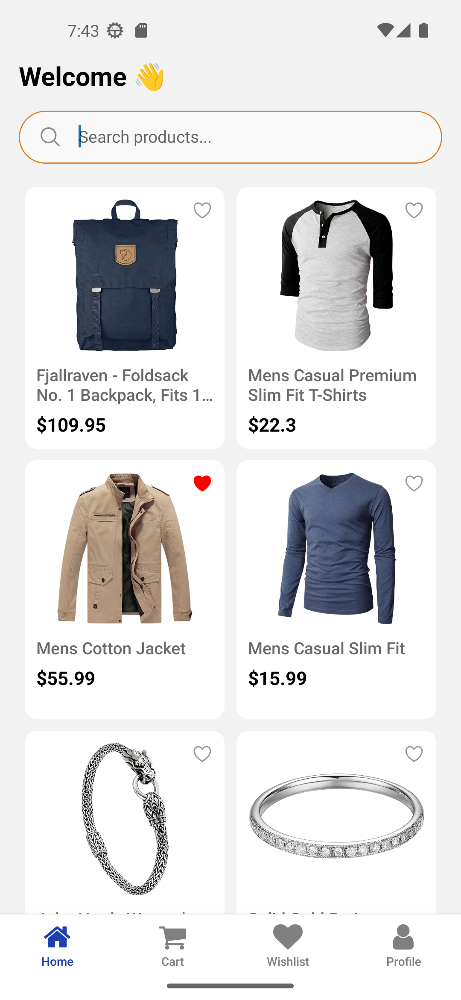
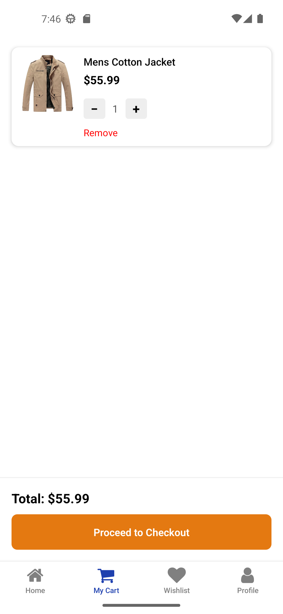
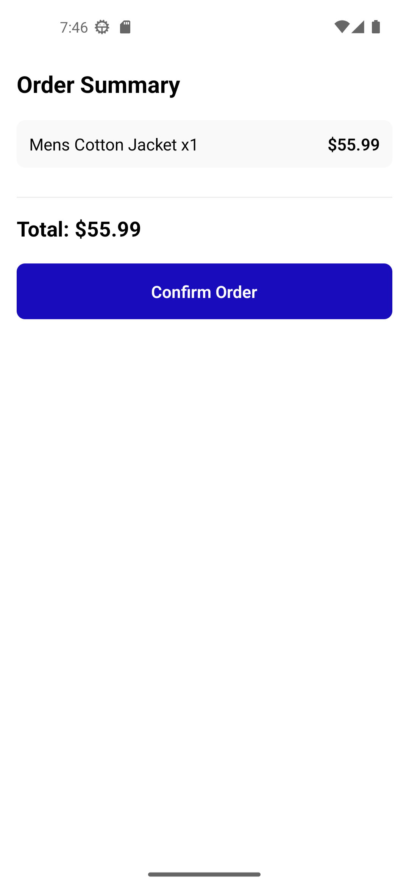
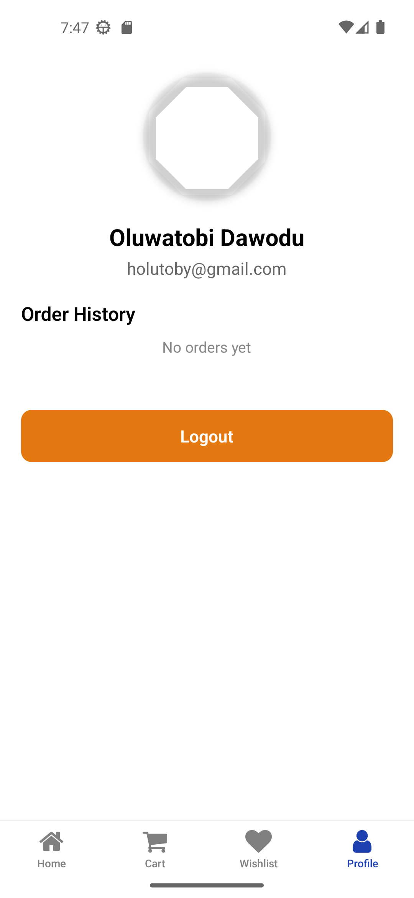
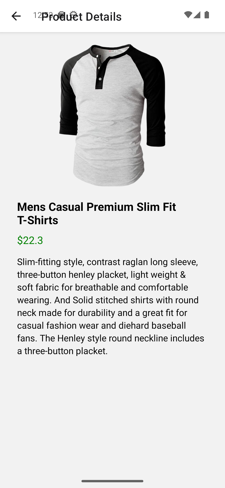

# Mobile E-Commerce Application (OtamaShop)

##  Description

OtamaShop is a mobile e-commerce application built with React Native and Expo.
It allows users to browse products, search for items, view product details, add items to cart, and simulate checkout.

The app demonstrates core mobile development concepts such as navigation, state management, persistent storage, and UI consistency.

---

##  Features Implemented

###  Authentication

* Login & Register screens
* Email & password validation
* Persistent login using AsyncStorage
* Logout functionality

###  Splash Screen

* Displays app name
* Auto-navigation after a few seconds

###  Home Screen

* Product listing from API (FakeStore API)
* Search functionality
* Product cards with:

  * Image
  * Title
  * Price
  * Rating

###  Product Details

* Large product image
* Description
* Price
* Quantity selector
* Add to cart functionality

###  Cart

* List of added products
* Increase/decrease quantity
* Remove items
* Total price calculation
* Empty cart state

###  Checkout

* Order summary
* Simulated checkout process
* Clear cart after order

###  Profile

* User information display
* Logout functionality

---

##  Tech Stack

* React Native
* Expo
* TypeScript
* AsyncStorage (for persistence)
* Expo Router (navigation)
* Context API (state management)

---

##  Folder Structure Explanation

The project is structured for scalability and maintainability:

* `app/` → Contains screens and navigation (Expo Router structure)
* `src/components/` → Reusable UI components (e.g., ProductCard)
* `src/context/` → Global state management (CartContext)
* `src/screens/` → Organized screen logic (where applicable)

This structure separates concerns and improves code readability.

---

##  Screenshots

# Splash Screen

# Login Screen

# Home Screen

# Cart Screen

# Checkout Screen

# Profile Screen

# Product details Screen

---

##  Optimization Techniques Used

* **useMemo**

  * Used to optimize expensive calculations like total cart price

* **useCallback**

  * Used for functions passed to components to prevent unnecessary re-renders

* **React.memo**

  * Applied to reusable components like ProductCard to improve performance

---

##  Challenges Faced

* Managing navigation flow between authentication and main app
* Handling persistent cart state across app reloads
* Fixing TypeScript errors (implicit `any`)
* Debugging asset loading and splash screen issues
* Handling API data and filtering for search functionality

---

##  Submission Notes

* Project is fully pushed to GitHub
* Clean structure with reusable components
* App runs and demonstrates all core features

---

##  Conclusion

This project helped reinforce key concepts in React Native development, including navigation, state management, performance optimization, and building scalable UI components.
